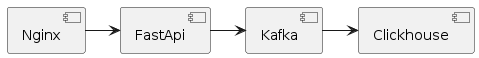

- [Сервис yap_ugc](#сервис-yap_ugc)
  - [Компоненты](#компоненты)
  - [Установка](#установка)
  - [Эксплуатация](#эксплуатация)

# Сервис yap_ugc
Сервис позволяет сохранять информацию о различных собития он-лайн кинотеатра для последующего анализа.


## Компоненты


Данные поступают через API в топик кафка, после перемещаются в распределенную таблицу ClickHouse, используя встроенный в ClickHouse движок - Kafka.

## Установка

1. Создать сеть yap_ugc_network
``` 
docker network create -d bridge yap_ugc_network 
```
2. Перейтив  папку в confluent и запустить Kafka
``` 
docker compose -f docker-compose.yml --env-file=../.env.docker up -d
```
3. Создать топик user_films_lasttime
``` 
docker compose -f docker-compose.yml exec broker kafka-topics --create --bootstrap-server broker:29092 --topic user_films_lasttime --partitions 4 --replication-factor 1
```
4. Перейтив папку в clickhouse и запустить Clickhouse
``` 
docker compose -f docker-compose.yml --env-file=../.env.docker up -d
```
5. Документация будет доступна по (URL)[http://127.0.0.1:8000/api/docs]


## Эксплуатация
1. Удалить топик
```
docker compose exec broker kafka-topics --delete --bootstrap-server broker:29092 --topic user_films_lasttime
```


